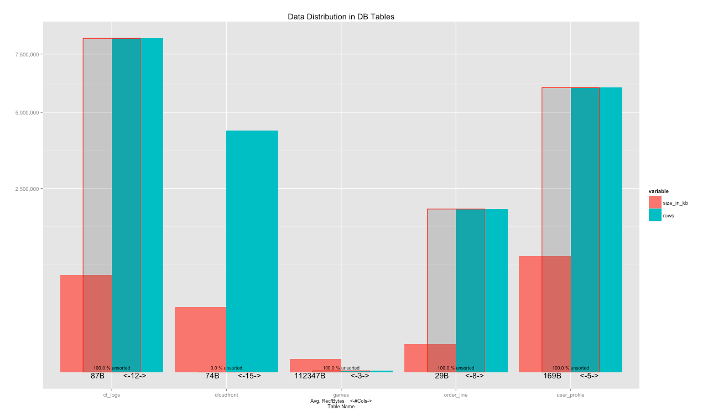
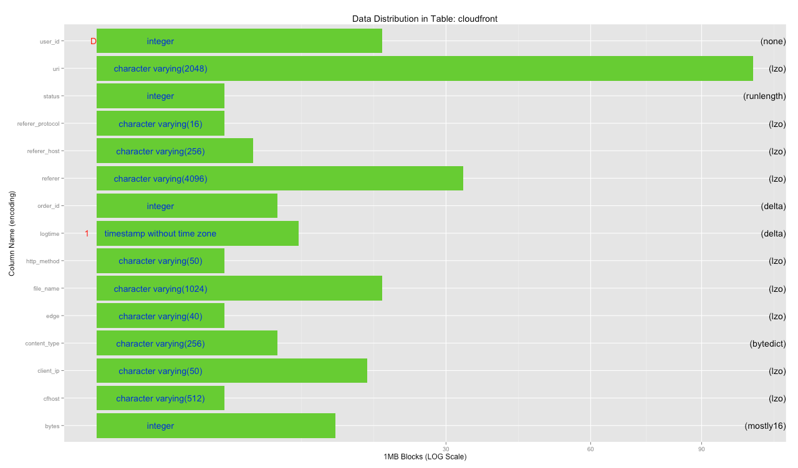
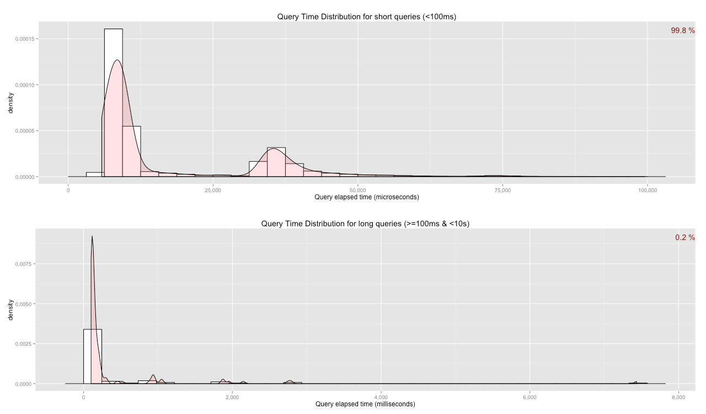
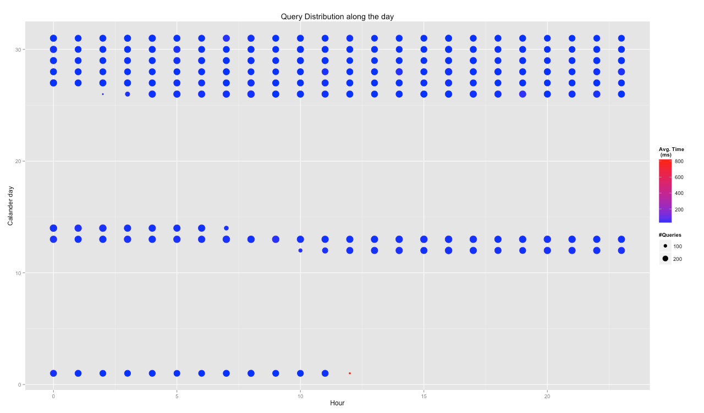

RedshiftRDBA
============

DBA library for Amazon Redshift

Amazon Redshift is a powerful data warehouse in the cloud. It can process tons of data with ease, but it is important to understand what is going on under the hood in terms of table data design and query design.

This library is designed to give DBA or Redshift a quick way to run various queries to the various system tables in Redshift and visualise its results.

The library is using R, thanks to its open source nature, speed and data visualisation integration.

The library is divided into several parts:

* General table view - which tables are defined, what is their relative size in terms of Bytes and rows and how much they are sorted
* Table view - which columns are defined in a specific table, what is their relative size and their encoding
* General Queries view - how many queries are running on the DB and their relative distribution into fast and slow queries

Getting Started
===============

1. Install R (and RStudio)
--------------------------

There are many tutorial on how to install R and its popular IDE Rstudio.

The easiest way is to launch an EC2 instance with everything already preinstalled:

* Using a web browser: 

http://www.louisaslett.com/RStudio_AMI/

* Using AWS CLI (http://aws.amazon.com/cli/):

  `aws ec2 run-instances --image-id ami-1ffd6d2f`
    
    `--instance-type m3.xlarge` 
    
    `--security-groups RStudioServer`
    
    `--region us-west-2`

(Please remember to modify the user and password of the remote RStudio)

2. Grant permission to access your Redshift cluster to your local or remote R 
--------------------------

* Using a web browser: 

http://docs.aws.amazon.com/redshift/latest/mgmt/working-with-security-groups.html

* Using AWS CLI:

  `aws redshift authorize-cluster-security-group-ingress --cluster-security-group-name default --ec2-security-group-name RStudioServer`

3. Install the RedshiftRDBA library
-------------------------

Until it is nicely packaged, you need to copy the files to your machine and source them

`source('~/RedshiftRDBA/Summary.R')`

To make sure that you are loading the needed packages, connect to your Redshfit cluster after this first file definition

`con <- clusterConnect("cluster-name.xxxxxxxxxx.us-west-2.redshift.amazonaws.com", "dev", "user", "password")`

Then you can continue with sourcing the rest of the files as needed

`source('~/RedshiftRDBA/TableDesign.R')`

`...`

Using the DBA library
====================

### Connecting to your Redshift cluster

`con <- clusterConnect("cluster-name.xxxxxxxxxx.us-west-2.redshift.amazonaws.com", "dev", "user", "password")`

Please note that the library is accessing the system tables and views, therefore it requires superuser priviliges for the user connecting (superuser explanation: http://docs.aws.amazon.com/redshift/latest/dg/r_superusers.html)

### DB Summary

`DBSummaryTable <- DBSummary(con)`

`plotSummary(DBSummaryTable)`

Please note that you might have a very big list of tables with duplicate names in mulitple schema. You can limit the plotting to a specific schema with:

`mySchemaName <- 'my_schema_name'`

`mySchema <- DBSummaryTable[which(DBSummaryTable$nspname==mySchemaName & DBSummaryTable$schemaname==mySchemaName & DBSummaryTable$btrim==mySchemaName),]`

If you have too many tables in a single schema and finding it hard to plot all the table together you can subset the list by:

`plotSummary(mySchema[which(substr(mySchema$table_name,1,3)=='log'),])`

### Table Summary

`cloudfrontTable <- tableCols(con, "cloudfront")`

`plotTable(cloudfrontTable)`

### Query Summary

`plotQueryDistribution(con)`

`hourHeatMap(con)`

